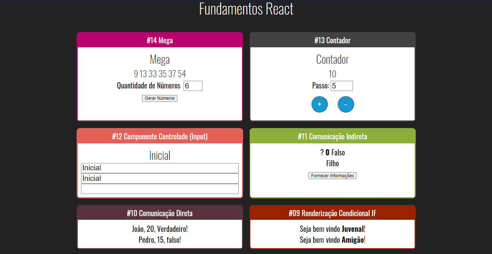
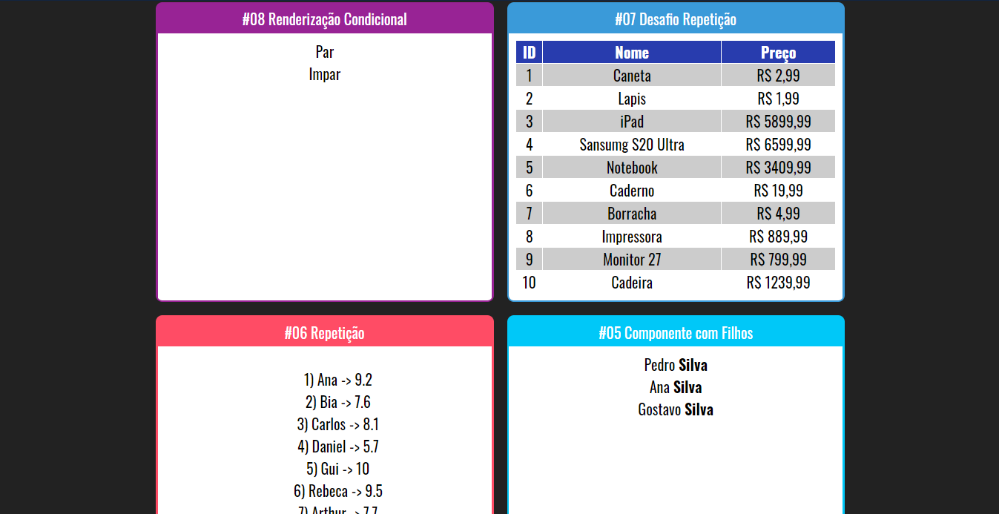
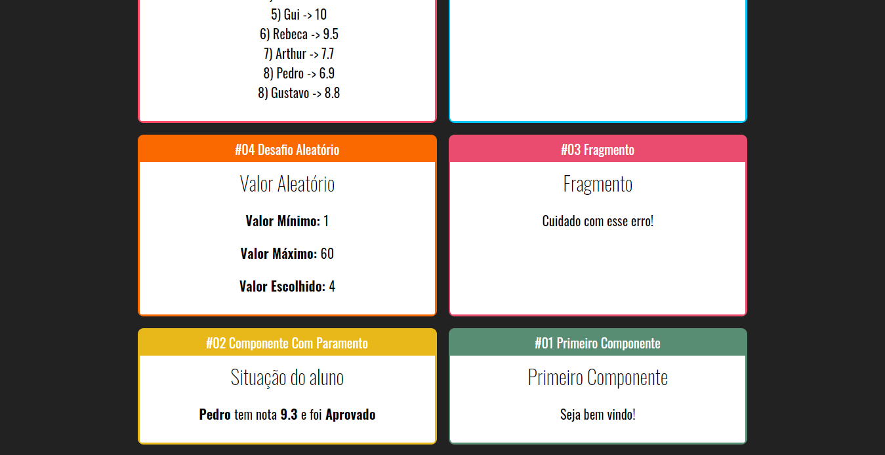

<h1 align='center'>Projetos Curso React e Redux da Cod3r</h1>

<h3>🔖 Descrição</h3>

Projetos desenvolvido ao longo do curso de React e Redux da Cod3r.

<h3>🚀 Tecnologias</h3>
<ul>
    <li><h4>React</h4></li>
    <li><h4>React Route</h4></li>
    <li><h4>Redux</h4></li>
    <li><h4>JavaScript</h4></li>
    <li><h4>CSS</h4></li>
</ul>

<h3>ℹ️ Como usar</h3>

    # Clone esse repositório
    $ git clone 
    
    # Instalar dependências do projeto
    $ npm install
    
    # Executar o comando para rodar o projeto server
    $ npm run dev
    
    # Executar o comando para rodar o projeto web
    $ npm start

<h1>🖼 Fundamentos</h1>

 

 

 
